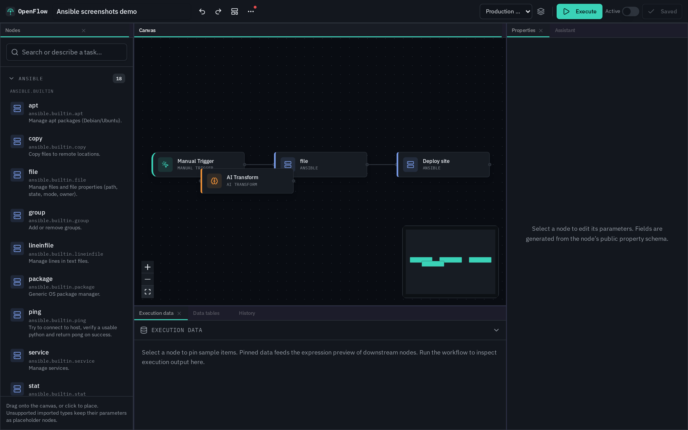
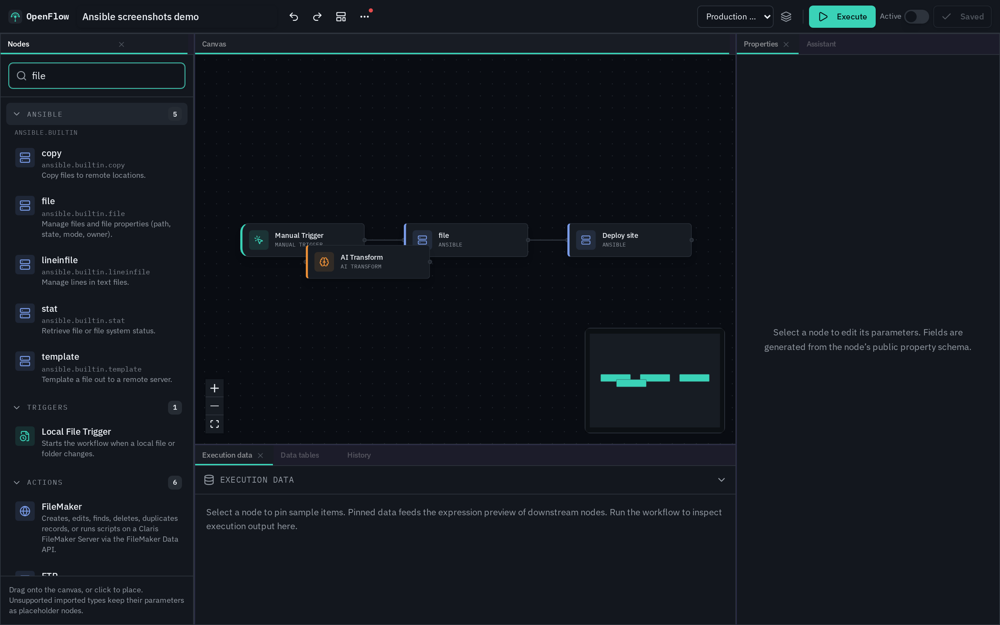

# ansible-flow-mcp

MCP server that exposes **Ansible modules and playbooks** to AI agents:

**search → schema → check → execute**

<p align="center">
  
</p>

Dual-tracked with [OpenFlow](https://github.com/real-limitless/OpenFlow) Ansible canvas gallery  
([plan](https://github.com/real-limitless/ansible-flow-mcp/issues/1) · [OpenFlow umbrella](https://github.com/real-limitless/OpenFlow/issues/56) · [validation](https://github.com/real-limitless/ansible-flow-mcp/issues/1#issuecomment-5227918129)).

Not affiliated with Red Hat or the Ansible project beyond using the public Ansible CLI and docs.

## Requirements

- Python ≥ 3.11
- `ansible` / `ansible-core` on `PATH` for real runs (unit tests mock the CLI)
- Collection **`ansible.posix`** (JSON stdout callback `ansible.posix.json` on ansible-core ≥ 2.15)
- Other collections you intend to use installed on the control node

```bash
python3 -m pip install --user 'ansible-core>=2.16,<2.19'
export PATH="$HOME/.local/bin:$PATH"
ansible-galaxy collection install ansible.posix
```

## Install (dev)

```bash
cd ansible-flow-mcp
python -m venv .venv
source .venv/bin/activate
pip install -e ".[dev]"
pytest
```

## Run (stdio MCP)

```bash
ansible-flow-mcp
# or: python -m ansible_flow_mcp.server
```

### Cursor / Claude Desktop

See `examples/cursor-mcp.json` and `examples/claude-desktop.json`.

Local path example:

```json
{
  "mcpServers": {
    "ansible-flow": {
      "command": "/path/to/ansible-flow-mcp/.venv/bin/ansible-flow-mcp"
    }
  }
}
```

## Tools

| Tool | Purpose |
| --- | --- |
| `search_modules` | Gallery search |
| `get_module_schema` | Slim argSpec for FQCN |
| `run_module` | Ad-hoc ansible (`check_mode` default **true**) |
| `run_playbook` | `ansible-playbook` on a path-jailed `.yml` |
| `list_collections` | Collections in gallery |

### Agent ritual (modules)

1. `search_modules`  
2. `get_module_schema`  
3. `run_module(..., check_mode=true)`  
4. `run_module(..., check_mode=false)` if appropriate  

### Agent ritual (playbooks)

1. Confirm playbook path is under an allowlisted root  
2. `run_playbook(..., check_mode=true)`  
3. `run_playbook(..., check_mode=false)` if appropriate  

<p align="center">
  
</p>

## Catalog

- `catalog/collections-allowlist.yml` — allowed collections + denied free-form modules  
- `catalog/gallery.json` — searchable module list  
- `catalog/schemas/*.json` — optional UI/agent schemas (full gallery coverage)

Regenerate when `ansible-doc` is available:

```bash
pip install pyyaml
python scripts/generate_catalog.py
```

### Galaxy factory (top collections)

Scrape **top Galaxy collections by download count**, queue module schema jobs, merge into the gallery — OpenFlow-style TUI:

```bash
python scripts/factory/tui.py
# or headless:
python scripts/factory/scrape_galaxy.py --top 40 --enqueue
python scripts/factory/queue_worker.py
```

See [scripts/factory/README.md](scripts/factory/README.md).

## Env

| Variable | Meaning |
| --- | --- |
| `ANSIBLE_FLOW_CATALOG_DIR` | Override catalog path |
| `ANSIBLE_FLOW_COLLECTIONS` | Comma-separated collection allowlist override |
| `ANSIBLE_FLOW_INVENTORY` | Default `-i` inventory |
| `ANSIBLE_FLOW_TIMEOUT` | Seconds (default 120 module / 300 playbook) |
| `ANSIBLE_FLOW_PLAYBOOK_ROOTS` | Extra colon-separated playbook path roots |
| `OPENFLOW_ANSIBLE_PLAYBOOK_ROOTS` | Same roots (OpenFlow-compatible alias) |

Default playbook roots include cwd, `./playbooks`, `./ansible`, `/data/ansible`, and the system temp dir. Max playbook size 2MB; `.yml` / `.yaml` only.

## Security

See [docs/SECURITY.md](docs/SECURITY.md). Free-form modules (`command`/`shell`/`raw`/`script`) are **denied** by default. Playbooks are path-jailed. CLI is argv-only (no shell interpolation). Structured output uses **`ansible.posix.json`**.

## OpenFlow parity

| OpenFlow | This MCP server |
| --- | --- |
| Palette Ansible gallery | `search_modules` |
| Form \| JSON module options | `get_module_schema` + `run_module` args |
| Playbook resource | `run_playbook` |
| `ansibleSsh` / become | Inventory / Ansible config on the control node |

Golden runner fixtures under `tests/fixtures/` define the shared result shape for OpenFlow’s `openflow-node-base.ansible` executor (TypeScript port).

OpenFlow docs: [docs/ansible.md](https://github.com/real-limitless/OpenFlow/blob/main/docs/ansible.md)

## License

Apache-2.0

## Publish (PyPI)

```bash
pip install build twine
python -m build
# twine upload dist/*
```

Or from git:

```bash
uvx --from ansible-flow-mcp ansible-flow-mcp
```

Schemas cover the full committed gallery (builtin + popular collections). Regenerate with `scripts/generate_catalog.py` when `ansible-doc` is available.
