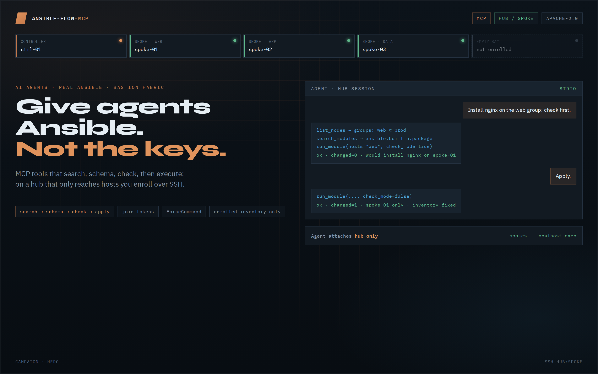
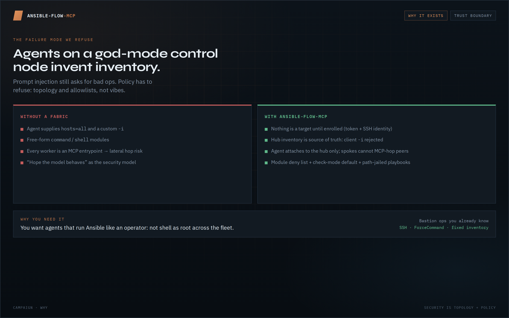
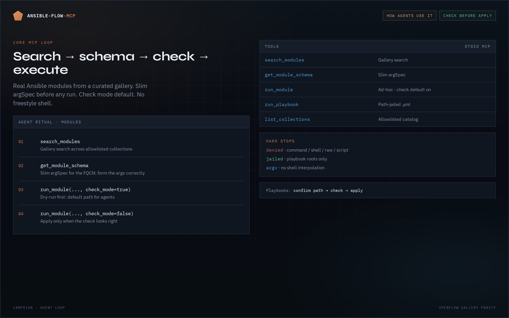
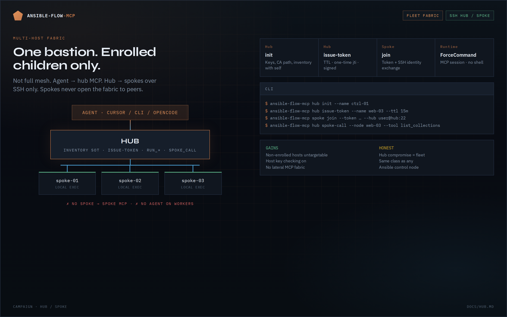
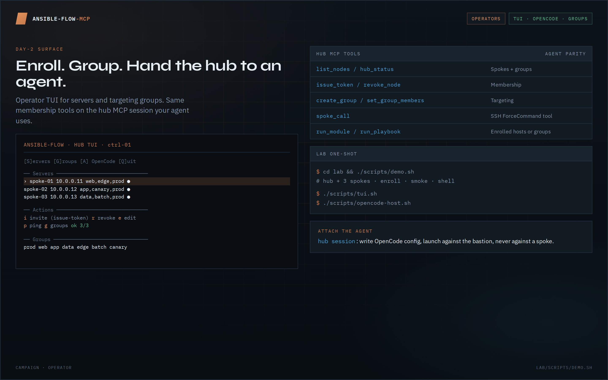

# ansible-flow-mcp

**Give agents Ansible. Not the keys.**

MCP server that exposes real Ansible modules and playbooks to AI agents — and a **SSH hub/spoke fabric** so multi-host automation is enrolled, bastion-scoped, and check-first by default.



| Track | What you get |
| --- | --- |
| **Agent loop** | `search → schema → check → execute` on allowlisted collections |
| **Fleet fabric** | One hub · join tokens · SSH ForceCommand spokes · fixed inventory |

[Issue #2 · hub/spoke](https://github.com/real-limitless/ansible-flow-mcp/issues/2) · [OpenFlow dual-track](https://github.com/real-limitless/OpenFlow) · [Campaign storyboard](docs/campaign/) · Apache-2.0

Not affiliated with Red Hat or the Ansible project beyond using the public Ansible CLI and docs.

---

## Visual tour

| | |
| :---: | :---: |
| **Why it exists** | **Agent loop** |
|  |  |
| **Hub / spoke fabric** | **Operators** |
|  |  |

Screenshots live in [`docs/images/campaign-*.png`](docs/images/). Re-shoot from [`docs/campaign/`](docs/campaign/) with `./capture.sh`.

---

## Why this exists

Agents on a god-mode control node invent inventory, reach for `shell`, and treat every worker as an entrypoint. That is not a security model.


**You need this when:**

- You want Cursor / Claude / OpenCode to run Ansible **like an operator**, not freestyle root across the fleet
- Multi-host must mean **bastion ops you already understand** (SSH, inventory, enrollment) — not a mesh hop plane
- Prompt injection will still *ask* for bad ops — **policy and topology must refuse**

---

## Two tracks

### 1. Agent loop — search → schema → check → execute

Curated module gallery. Slim argSpec before any run. Check mode default. Free-form modules denied. Playbooks path-jailed.


| Tool | Purpose |
| --- | --- |
| `search_modules` | Gallery search |
| `get_module_schema` | Slim argSpec for FQCN |
| `run_module` | Ad-hoc Ansible (`check_mode` default **true**) |
| `run_playbook` | `ansible-playbook` on a path-jailed `.yml` |
| `list_collections` | Collections in gallery |

**Ritual (modules):** `search_modules` → `get_module_schema` → `run_module(..., check_mode=true)` → apply only if appropriate.

**Ritual (playbooks):** confirm path under allowlisted roots → check → apply.

### 2. Hub/spoke — nothing is a target until enrolled

Secure multi-host mode from [issue #2](https://github.com/real-limitless/ansible-flow-mcp/issues/2): **agent attaches to the hub only**. Hub reaches spokes over **SSH only**. Spokes execute **localhost** and cannot lateral-move via this fabric.


| | Full mesh (withdrawn) | **Hub/spoke (shipped)** |
| --- | --- | --- |
| Worker compromise | Could MCP-hop fleet-wide | **No lateral MCP** |
| Inventory | Gossip / replicas | **Hub is source of truth** |
| Agent attach | Any node | **Hub only** |
| Ops model | Mesh OS | **Classic Ansible bastion** |

**Enrollment:** `hub init` → `issue-token` (TTL, one-time jti) → `spoke join` (token + SSH identity) → hub inventory. Runtime: ForceCommand MCP session — **no shell** on the hub→spoke path.

**Hub tools:** `list_nodes` / `hub_status`, `issue_token`, `revoke_node`, groups (`create_group`, `set_group_members`, …), `spoke_call`, plus catalog `run_*` against **enrolled hosts or groups only**. Client-supplied `-i` is rejected in hub mode.

Deep ops: **[docs/HUB.md](docs/HUB.md)**.

---

## Operators

Day-2 surface matches the agent: enroll, group, hand the hub to OpenCode.


```bash
ansible-flow-mcp hub init --name ctrl-01
ansible-flow-mcp hub issue-token --name web-03 --ttl 15m
ansible-flow-mcp spoke join --token "$TOKEN" --hub user@hub:22 --public-addr web-03.example.com
ansible-flow-mcp hub session          # MCP stdio for the agent
ansible-flow-mcp tui                  # servers · groups · invite · OpenCode
ansible-flow-mcp hub spoke-call --node web-03 --tool list_collections
```

### Lab one-shot

```bash
cd test && ./scripts/demo.sh
# then: ./scripts/tui.sh  |  ./scripts/opencode-host.sh
```

See [test/README.md](test/README.md).

---

## Quick start (single-node / dev)

### Requirements

- Python ≥ 3.11
- `ansible` / `ansible-core` on `PATH` for real runs
- Collection **`ansible.posix`** (JSON callback)
- Collections you intend to use installed on the control node

```bash
python3 -m pip install --user 'ansible-core>=2.16,<2.19'
export PATH="$HOME/.local/bin:$PATH"
ansible-galaxy collection install ansible.posix
```

### Install & run

```bash
cd ansible-flow-mcp
python -m venv .venv && source .venv/bin/activate
pip install -e ".[dev]"
pytest
ansible-flow-mcp
# or: python -m ansible_flow_mcp.server
```

### Cursor / Claude Desktop / OpenCode

- `examples/cursor-mcp.json`, `examples/claude-desktop.json`
- Hub + OpenCode: `examples/opencode-hub.jsonc` · `ansible-flow-mcp hub write-opencode-config`

```json
{
  "mcpServers": {
    "ansible-flow": {
      "command": "/path/to/ansible-flow-mcp/.venv/bin/ansible-flow-mcp"
    }
  }
}
```

---

## Security (honest)

| Control | Behavior |
| --- | --- |
| Collection allowlist | Only configured collections |
| Module deny list | `command` / `shell` / `raw` / `script` denied by default |
| Check mode | Default **true** on `run_module` |
| Playbook jail | Allowlisted roots · size limit · `.yml`/`.yaml` only |
| No shell interpolation | argv-only subprocess |
| Hub inventory | Enrolled hosts only · no client `-i` · host key checking on |
| Spoke path | SSH ForceCommand · localhost exec · no peer fabric |

**Residual:** hub compromise = fleet (same class as any Ansible control node). Harden the bastion — see [docs/SECURITY.md](docs/SECURITY.md) and hub hardening in issue #2 / [docs/HUB.md](docs/HUB.md).

---

## Catalog & OpenFlow

- `catalog/collections-allowlist.yml` — allowlist + deny free-form modules  
- `catalog/gallery.json` + `catalog/schemas/` — searchable gallery  
- Regenerate: `python scripts/generate_catalog.py`  
- Galaxy factory TUI: [scripts/factory/README.md](scripts/factory/README.md)

Dual-tracked with [OpenFlow](https://github.com/real-limitless/OpenFlow) Ansible canvas gallery  
([plan](https://github.com/real-limitless/ansible-flow-mcp/issues/1) · [umbrella](https://github.com/real-limitless/OpenFlow/issues/56)).

| OpenFlow | This MCP server |
| --- | --- |
| Palette Ansible gallery | `search_modules` |
| Form \| JSON module options | `get_module_schema` + `run_module` |
| Playbook resource | `run_playbook` |
| Control-node SSH / become | Inventory + Ansible config · hub→spoke SSH in hub mode |

---

## Env (common)

| Variable | Meaning |
| --- | --- |
| `ANSIBLE_FLOW_CATALOG_DIR` | Override catalog path |
| `ANSIBLE_FLOW_COLLECTIONS` | Comma-separated allowlist override |
| `ANSIBLE_FLOW_INVENTORY` | Default `-i` (non-hub / dev) |
| `ANSIBLE_FLOW_TIMEOUT` | Seconds (default 120 module / 300 playbook) |
| `ANSIBLE_FLOW_PLAYBOOK_ROOTS` | Extra playbook roots (`:`-separated) |
| `ANSIBLE_FLOW_HUB_DIR` | Hub state (default `/var/lib/ansible-flow/hub`) |
| `ANSIBLE_FLOW_SPOKE_DIR` | Spoke state (default `/var/lib/ansible-flow/spoke`) |

---

## License & publish

Apache-2.0

```bash
pip install build twine && python -m build
# twine upload dist/*
```

```bash
uvx --from ansible-flow-mcp ansible-flow-mcp
```
